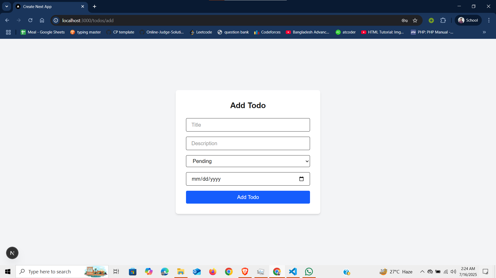
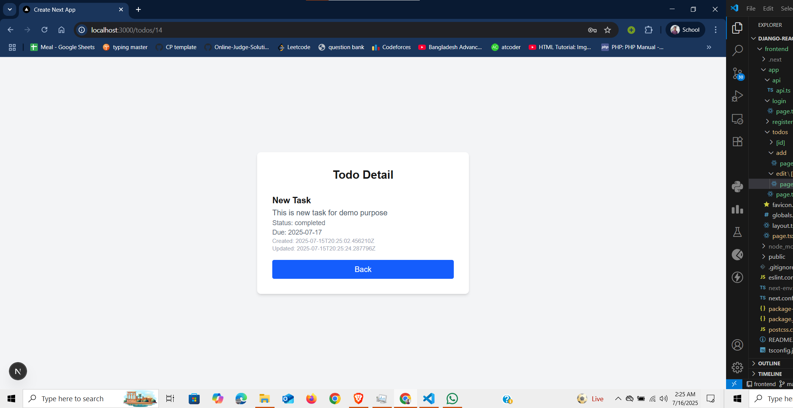

# Django-React-Todo-application
This is a assignment task for Gigatech Apprentice – Software Development Position

# API Documentation
Base URL: http://127.0.0.1:8000/api/auth/

## 1. Register a New User  
**URL**: /register/  
**Method**: POST  
**Authentication**: Not Required  
**Description**: Registers a new user account  
**Request Body (JSON)**  
<pre>{
  "username": "rakib12345",
  "email": "rakib12345@gmail.com", 
  "password": "1234" 
}</pre>
**Response (json)**  
<pre>{
  "username": "rakib12345",
  "email": "rakib12345@gmail.com", 
  "password": "pbkdf2_sha256$1000000$...."
}</pre>

## 2. Login User (Obtain JWT Token)  
**URL**: /login/  
**Method**: POST  
**Authentication**: Not Required  
**Description**: Authenticates a user and returns access and refresh tokens  
**Request Body (JSON)**  
<pre>{
  "username": "rakib12345",
  "password": "1234" 
} </pre>
**Response (JSON)**  
<pre>{
  "refresh": "<refresh_token>", 
  "access": "<access_token>",
  "user": {
    "id": 8, 
    "username": "rakib12345", 
    "email": "rakib12345@gmail.com" 
  }
} </pre>

Todo Endpoints (Protected)  

## 3. List All Todos  

**URL**: /todo/  
**Method**: GET  
**Authentication**:  Required  
**Description**: Returns all todos for the authenticated user  
**header:**  
**Authorization:** Bearer <access_token>  
**Response (JSON)**  
[  
  <pre> {
    "id": 12, 
    "user": 8,
    "title": "rasdr", 
    "description": "refver",
    "status": "pending", 
    "due_date": "2025-07-17", 
    "created_at": "2025-07-15T19:43:07.194107Z",
    "updated_at": "2025-07-15T19:43:07.194107Z"
  } </pre>
  ...
]  

## 4. Create a New Todo  
**URL**: /todo/  
**Method**: POST  
**Authentication**:  Required  
**Description**: Adds a new todo for the logged-in user  
**header:**  
**Authorization**: Bearer <access_token>  
**Request Body (JSON)**  
<pre> {
  "title": "New title added", 
  "description": "", 
  "status": "pending", 
  "due_date": "2025-07-17" 
}</pre>
**Response (JSON)**  
<pre> {
  "id": 25, 
  "user": 8,
  "title": "New title added", 
  "description": "", 
  "status": "pending", 
  "due_date": "2025-07-17", 
  "created_at": "2025-07-16T05:01:46.514964Z", 
  "updated_at": "2025-07-16T05:01:46.514964Z" 
} </pre>

## 5. Get a Specific Todo (Detail View)  
**URL**: /todo/<id>/  
**Method**: GET  
**Authentication**:  Required  
**Description**: Get detailed information of a single todo  
**header:**  
**Authorization:** Bearer <access_token>  
**Example url:** /todo/12/  
**Response (JSON)**  
<pre>{
  "id": 12,
  "user": 8, 
  "title": "rasdr", 
  "description": "refver", 
  "status": "pending", 
  "due_date": "2025-07-17", 
  "created_at": "2025-07-15T19:43:07.194107Z", 
  "updated_at": "2025-07-15T19:43:07.194107Z" 
}</pre>

## 6. Update a Todo  
**URL**: /todo/<id>/  
**Method**: PUT  
**Authentication**:  Required  
**Description**: Update the specified todo  
**header**:  
**Authorization**: Bearer <access_token>  
**Example url:** /todo/25/  
**Request Body (Any or all fields)**  
<pre>{
  "title": "Title updated",
  "description": "",
  "status": "pending", 
  "due_date": "2025-07-17" 
}</pre>
**Response (JSON)**  
<pre> {
  "id": 25, 
  "user": 8, 
  "title": "Title updated", 
  "description": "", 
  "status": "pending", 
  "due_date": "2025-07-17",
  "created_at": "2025-07-16T05:01:46.514964Z",
  "updated_at": "2025-07-16T05:25:26.870457Z"
}</pre>

## 7. Delete a Todo  
**URL**: /todo/<id>/  
**Method**: DELETE  
**Authentication**:  Required  
**Description**: Deletes a todo owned by the user  
**header:**  
**Authorization:** Bearer <access_token>  
**Response (Success)**  
<pre>{
  "message": "Task deleted"
} </pre>
**Response (If not authorized or not the owner)**  
<pre> {
  "error": "Task not found"
} </pre>

# Website preview
### Login Page

### Signup Page

### Todo List

### Add Todo Page

### Todo list (after adding a task)

### Details Page

### Edit Page

# Watch a demo on youtube
<<<<<<< HEAD
https://youtu.be/g3JYi7Ecd04
=======
https://youtu.be/g3JYi7Ecd04
>>>>>>> 55e72b11a08adc1cac5c5842534a92c3a6971c82
